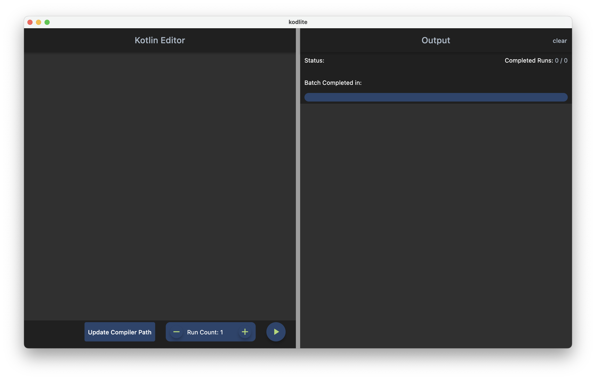
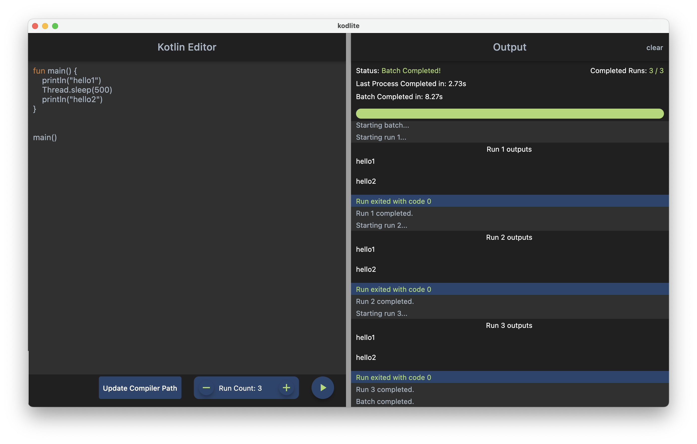
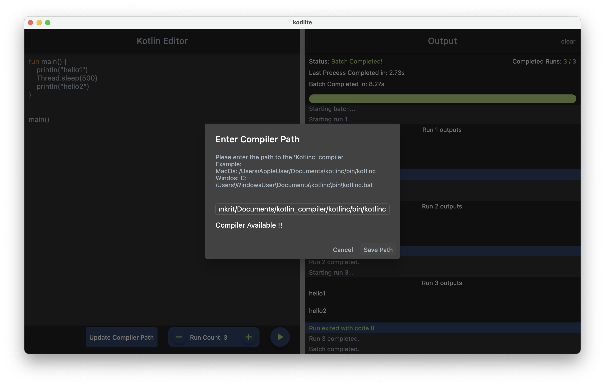
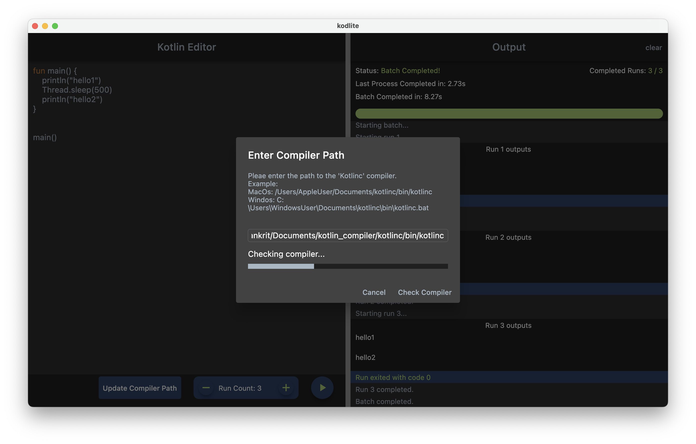

<h1 align="center">
  <a href="https://github.com/AlankritNayak/Kodlite">
    <!-- Please provide path to your logo here -->
    
  </a>
</h1>

  kodlite
   
 

 

---
**MacOS App Download Link:** 
https://drive.google.com/file/d/1hnkQYwS13A_UH3t568WeZulKk2Hi5abu/view?usp=sharing

## About

> Kodlite simple GUI tool, which allows users to write a Kotlin script, run it and see the outputs in realtime side by side. The Kotlin script can be run multiple times with one button click. Output pane is made so that its easy to distinguish the outputs of each run separately.
>
>This Project is made as a part of JetBrains internship application.

### Features
- **Kotlin Editor:** Allows user to edit Kotlin code in an inbuilt editor.
- **Multiple Runs:** User can specify how many times they want to run a script. The output pane is designed so that outputs for each run is shown in a separately. This makes multiple runs easily distinguishable.
- **Estimated Remaining Time:** Shows the estimated time to complete a batch of runs. This is calculated using **Weighted Averages**. Most recent runs are weighted higher than older once.
- **Progress Bar:** Displays progress bar and number of runs completed.
- **Realtime run duration updates:** Provides realtime updates on 
  - Time Taken by previous run.
  - Total time taken by batch to complete (all runs).
  - Time taken by last run of the batch.
- **Exit Codes** User can see the output of the script side by side in the Output pane, this includes exit codes and any script outputs. 
  - The output pane not only shows outputs of a runs, but also, extra information, ex: "Starting run 1...", "Run 1 completed." 
- **Keyword Highlighting:** Highlights some language keywords, in real time.
- **Error Navigation** If an error occurs, user can click the error message, and this will focus the cursor to the exact error location.
  - Kotlin compiler errors, like syntax errors are show separately than normal error, for easy visibility.
- **Custom Compiler Path:** User can specify the path to the kotlinc compiler, they want to use on their machine. Checks if the compiler is available during the start, allows script run option only if compiler is available.
- **Local Persistance:** Only asks for compiler path once, and saves it for future runs. Also allows changing compiler path anytime.

Screenshots

 

|                               Home Page                               |                               Example Output                               | 
| :-------------------------------------------------------------------: | :--------------------------------------------------------------------: |
|  |  | 

|                               Change Compiler                               |                               Check Compiler                               | 
| :-------------------------------------------------------------------: | :--------------------------------------------------------------------: |
|  |  | 

### Built With

> **Flutter Framework** :https://flutter.dev/
> 
> **Bloc Library** https://bloclibrary.dev/#/
>
> **Riverpod** https://riverpod.dev/

## Getting Started

### Prerequisites

> **kotlinc**
> - You must download the [kotlinc](https://kotlinlang.org/docs/command-line.html#manual-install) command line compiler. It will be needed to run the kotlin scripts.
>  - Due to time constraints I have currently only created a **MacOS** version of this application. Hence in order to [download the application from drive link](https://drive.google.com/file/d/1hnkQYwS13A_UH3t568WeZulKk2Hi5abu/view?usp=sharing), you will need a computer running MacOS.

### Installation

>  Please download the **MacOS** application from the below drive link: 
> https://drive.google.com/file/d/1hnkQYwS13A_UH3t568WeZulKk2Hi5abu/view?usp=sharing
>
>- Currently I was only able to generate the MacOs version due to time constraints.
> - However Since the app is built using Flutter, its multiplatform, and a Windows and Linux version can be easily generated. If you are familiar with Flutter, and have it installed, you can easily the run same app in any platform (supported by flutter). By cloning the [GitHub Repository](https://github.com/AlankritNayak/Kodlite).

## Usage

> - Once downloading the zip file from the [drive link](https://drive.google.com/file/d/1hnkQYwS13A_UH3t568WeZulKk2Hi5abu/view?usp=sharing). Please unzip the file, and you will find the **"Kodlite"** MacOS App. 
> - When you launch the app for the time, it will prompt you to provide permission to access files on your computer. **Please allow this permission, because it is needed to save Kotlin scripts and pass them to the compiler.**
> - On startup, the app will check if you have already provided a path to the kotlinc compiler. If the kotlinc compiler is not found (which will be the case in the first run), you must provide the path to compiler using the **"Update Compiler Path" button**, at the bottom of the Editor.
> - Once the kotlinc compiler is found, you can start editing and running your kotlin script.
> - There is a **"Run Count"** button to set the number of times the script should be run. And a **Play Button** (With a play icon) at the bottom right of the editor, to run your script.
> When the Script is running you'll see all outputs in the Output pane on the right.
>

## Architecture
This App uses a layered architecture patter. Here is a brief explanation of each layer.
- Presentation Layer:
	- Contains Widgets, takes user input and interacts with application layer by sending Raw data. (ex: Strings etc)
 - Application Layer:
	 - Contains the **Business Logic Components** (Blocs), to hold business logic and manage state of the UI.
	- Widget Communicate with Immutable Blocs, by sending events
	- Blocs react to these events and outputs states.
	 - Presentation Layers receives this outputted state and behaves accordingly.
 - Domain Layer:
	 - The Application Layer communicates with the Infrastructure layer by mostly sending along Entities
	- Domain Layer contains entities. Entities are pure, in a sense that they don’t contain any flutter specific code, but only pure dart code.
	- Domain Layer also contains "Failure" classes. Objects of these classes will be returned from repository methods together with Entities.	As the name suggests Failures are returned when something bad happens in the repositories. Failures a usually implemented as a "Union Type", to differentiate between different failure cases.
	- ex: Failure.storage, Failure.compiler etc.
	-  Failures and Entities will be put into an "Either" type when they travel from Repositories to Application layer.
	-  As the name suggests an "Either" type is useful, to allow the business logic component to react in two different ways, during success of failure.
- Infrastructure Layer
	 - Contains **Repositories**. Repositories are responsible for providing data and communicating with external services.
	 - However in our small application the **kotlinc compiler is the external service**. Hence the repository communicates with it to run scripts and receive the outputs.
  

## Authors & contributors

The original setup of this repository is by [Alankrit Nayak](https://github.com/AlankritNayak).

## License

This project is licensed under the **MIT license**.

See [LICENSE](LICENSE) for more information.

